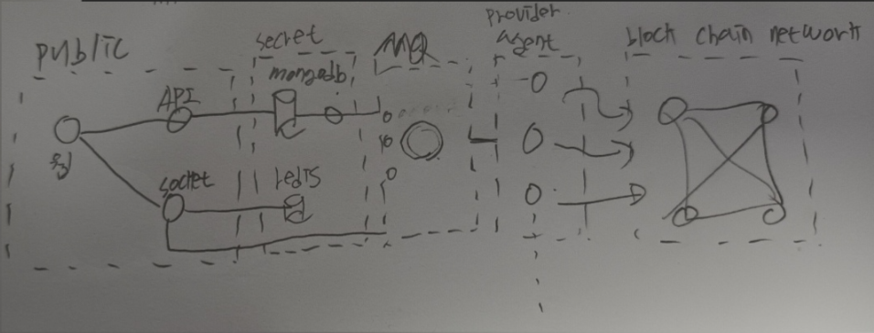

# Mung Scanner

### skills

* angular
* nestjs
* socketio
* web3
* swagger

### used solution

* mongodb
* redis
* kafka

### architecture



MQ는 일단 optional 한 형태로 진행한다.

# useage

### db

* up

```
$ npm run db:up
```

* down

```
$ npm run db:down
```

### agent

agent 서버는 블록체인의 정보를 주기적으로 가져온다

- 소켓서버
- 데이터베이스 업데이트(추후 MQ로 변경하여 MQ 컨슈머가 데이터베이스 업데이트 한다.)

---

* .env

***`docker/.env`*** 

```
RPC_IP=127.0.0.1:8545
```

RPC_IP에 노드 접속 정보를 연결한다

* up

```
$ npm run agent:up
```

* down

```
$ npm run agent:down
```